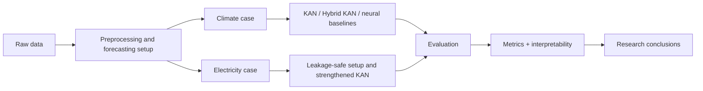

# Kolmogorov-Arnold Networks for Forecasting

This repository contains the main public materials for a research project on the application of Kolmogorov-Arnold Networks (KAN) to forecasting problems.

The project studies KAN not only as a predictive model, but also as an interpretable nonlinear modeling framework. The central question is simple: under what conditions does KAN work well in forecasting, and what exactly can be interpreted inside the model?

Two case studies are considered:

- climate forecasting on multivariate time series data;
- electricity forecasting on a regional panel dataset based on Russian electricity market data.

## Why This Repository Exists

The repository is meant to serve as:

- a companion repository for course, thesis, and research work;
- a compact demonstration of KAN-based forecasting experiments;
- a starting point for further work on interpretable nonlinear forecasting models.

In practical terms, the repository may be useful if you want to:

- compare KAN with more standard forecasting baselines;
- study how hybrid KAN architectures behave on different types of data;
- inspect an example of leakage-safe forecasting setup construction;
- reuse notebook-based experiments for academic work, demos, or further prototyping.

## Research Idea

KAN is interesting because it combines two attractive properties:

- nonlinear approximation ability;
- partial interpretability through learned one-dimensional phi-functions.

This makes KAN especially appealing in forecasting tasks where it is important not only to obtain a prediction, but also to understand what feature groups and nonlinear effects drive the forecast.

At the same time, the project shows an important nuance: KAN is not a universal winner on every dataset. Its practical usefulness depends on the structure of the problem, the choice of target, the feature representation, and the comparison baseline.

## Project Scheme



This scheme reflects the overall project logic: starting from raw data, constructing a correct forecasting setup, comparing model families, and then interpreting both predictive quality and internal model behavior.

## Repository Structure

### Climate forecasting

- `itmo_kan_timeseries.ipynb`

Main notebook with climate forecasting experiments. This notebook contains the time-series setup used to evaluate KAN and Hybrid KAN on multivariate climate data.

### Electricity forecasting

- `russian_electricity_eda.ipynb`
- `russian_electricity_real_kan.ipynb`
- `russian_electricity_stronger_kan.ipynb`

These notebooks cover the electricity part of the project:

- exploratory data analysis;
- baseline leakage-safe forecasting setup;
- strengthened KAN setup with improved results.

### Paper

- `paper_kan/main.tex`
- `paper_kan/references.bib`

LaTeX draft of the paper and the bibliography.

### Service files

- `requirements.txt`
- `.gitignore`

## What Is Studied in the Climate Case

The climate case is a multivariate time-series forecasting problem based on climate and air-quality variables.

The main goals there are:

- to test KAN and Hybrid KAN in a relatively clean sequence setting;
- to compare them with standard neural baselines;
- to inspect phi-functions and model interpretability in a setting where temporal structure is easier to analyze.

### Main climate conclusion

In the climate experiments, `Hybrid KAN` showed the best quality among the compared neural models. This makes the climate case the strongest example in the project of a setting where KAN-based hybridization is especially effective.

## What Is Studied in the Electricity Case

The electricity case is more difficult and more realistic. It is not just a single time series, but a panel forecasting problem with:

- regional heterogeneity;
- mixed-frequency signals;
- lagged features;
- strong seasonal patterns;
- the risk of temporal leakage if features are joined incorrectly.

Because of this, the electricity study focuses not only on models themselves, but also on the correctness of the forecasting setup.

The project uses a leakage-safe formulation:

- the prediction target is shifted forward in time;
- daily features are used only with lag;
- monthly tariff-related features are also used with lag.

This prevents unrealistically optimistic results caused by future information leaking into predictors.

### Main electricity conclusions

The electricity experiments led to two key findings.

First, in the baseline leakage-safe setup, strong boosting-based tabular models outperformed the initial KAN formulations.

Second, after strengthening the KAN setup by reformulating the target, improving the representation, and making the architecture more suitable for the task, the best KAN-family model became much more competitive.

So the electricity case shows that KAN can be useful, but only when the problem is formulated in a way that matches the architecture.

## Key Results at a Glance

| Case | Best overall result | Main interpretation |
|---|---|---|
| Climate forecasting | `Hybrid KAN` performed best among the compared neural models | KAN-style hybridization works especially well in a clean multivariate time-series setting |
| Electricity forecasting | boosting-based baselines were strongest overall, but strengthened KAN became much more competitive | KAN is useful when the forecasting setup is carefully adapted to the task |

## Main Scientific Conclusions

The overall conclusions of the project are:

- KAN is a promising interpretable nonlinear model family for forecasting.
- `Hybrid KAN` works particularly well on the climate multivariate time-series case.
- On the electricity panel forecasting task, conventional boosting baselines remain very strong.
- After strengthening the setup, KAN-based models become much more competitive and practically meaningful.
- The main value of KAN is not universal superiority in predictive accuracy, but the combination of nonlinear flexibility and interpretability.

## What Can Be Interpreted

One of the main motivations of the project is that KAN is not just another black-box predictor.

Depending on the experiment, the following aspects can be interpreted:

- phi-functions learned by KAN;
- relative importance of feature groups and channels;
- the role of lagged temporal structure;
- the difference between linear and nonlinear parts in hybrid models.

This is especially useful in research settings where the model is expected to provide not only a forecast, but also a meaningful explanation of what drives it.

## What Is Included and What Is Not

The repository intentionally contains only the main public materials:

- notebooks with the core experiments;
- the paper draft in LaTeX;
- the basic reproducibility files.

The repository does **not** include:

- the full raw electricity data dump;
- large generated intermediate artifacts;
- local auxiliary notebooks that are not part of the public project version.

This keeps the repository cleaner and more suitable for GitHub presentation.

## How to Use the Repository

### 1. Install dependencies

```bash
pip install -r requirements.txt
```

### 2. Open the notebooks

```bash
jupyter lab
```

### 3. Explore the project in a reasonable order

Recommended reading order:

1. `itmo_kan_timeseries.ipynb`
2. `russian_electricity_eda.ipynb`
3. `russian_electricity_real_kan.ipynb`
4. `russian_electricity_stronger_kan.ipynb`
5. `paper_kan/main.tex`

This order gives a natural progression from the cleaner climate case to the more complex electricity case, and then to the final written research narrative.

## What This Can Be Used For

This repository may be useful for:

- academic projects on interpretable machine learning;
- thesis work on forecasting methods;
- experiments with KAN and hybrid neural models;
- examples of leakage-safe forecasting design;
- research demos where both prediction quality and interpretability matter.

## Author

Kirill Alekhin  
ITMO University
